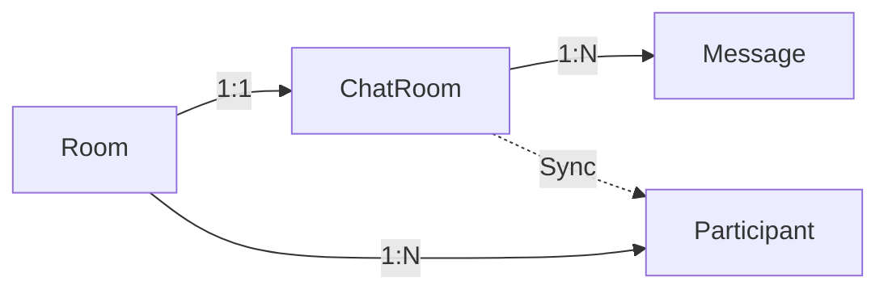

# Système de Chat SL3

## Vue d'ensemble

Le système de chat SL3 est une solution temps réel modulaire intégrant la gestion de multiples sessions, la modération et la mise en cache des messages.

### Technologies Clés

- Socket.IO pour la communication temps réel
- Redis pour la gestion du cache et des rooms
- MongoDB pour le stockage persistant
- NestJS pour le backend
- Next.js pour le frontend
- Bull pour la gestion des queues
- Giphy SDK pour les GIFs
- sharp pour l'optimisation des images
- socket.io-redis-adapter pour le clustering

## Architecture

### Intégration avec le Système de Room Existant

Le système de chat s'intègre avec le système de room existant :
- Chaque room peut avoir un chat associé
- Les permissions sont alignées avec les rôles existants (ADMIN, EVENT_ADMIN, ROOM_MODERATOR, etc.)
- Utilise le même système de slugs pour l'identification des rooms
- Partage le même système de gestion des participants

### Stratégies d'Intégration et Synchronisation

#### Relation Room-Chat


#### Gestion des Références
```typescript
// Exemple de validation dans ChatRoom
@Prop({
  required: true,
  validate: {
    validator: async function(roomId) {
      const room = await this.model('Room').findById(roomId);
      return room !== null;
    },
    message: 'Room must exist'
  }
})
roomId: Types.ObjectId;
```

#### Service de Synchronisation
```typescript
@Injectable()
export class ChatSyncService {
  @Cron('*/15 * * * *') // Toutes les 15 minutes
  async syncParticipants() {
    // Synchronisation des participants
  }
}
```

#### Monitoring et Récupération
- Détection des incohérences
- Réparation automatique
- Notifications des erreurs critiques
- Métriques de santé (latence, taux de sync, erreurs)

### Structure des Modules

```
apps/
├── web/
│   ├── components/
│   │   └── features/
│   │       └── rooms-global/
│   │           ├── room-detail/
│   │           │   └── chat/
│   │           │       ├── index.tsx
│   │           │       ├── chat-container.tsx
│   │           │       ├── chat-header.tsx
│   │           │       ├── chat-messages/
│   │           │       │   ├── index.tsx
│   │           │       │   ├── message-item.tsx
│   │           │       │   ├── message-thread.tsx
│   │           │       │   └── message-list.tsx
│   │           │       ├── chat-input/
│   │           │       │   ├── index.tsx
│   │           │       │   ├── emoji-picker.tsx
│   │           │       │   ├── gif-picker.tsx
│   │           │       │   ├── media-upload.tsx
│   │           │       │   └── typing-indicator.tsx
│   │           │       └── media/
│   │           │           ├── media-preview.tsx
│   │           │           ├── media-gallery.tsx
│   │           │           └── media-lightbox.tsx
│   │           └── management/
│   │               └── moderation/
│   │                   ├── index.tsx
│   │                   ├── banned-users.tsx
│   │                   ├── muted-users.tsx
│   │                   ├── content-filters.tsx
│   │                   ├── report-management.tsx
│   │                   └── action-history.tsx
│   ├── store/
│   │   └── features/
│   │       ├── chat/
│   │       │   ├── chat.store.ts
│   │       │   ├── media.store.ts
│   │       │   └── room.store.ts
│   │       └── moderation/
│   │           ├── moderation.store.ts
│   │           └── reports.store.ts
│   └── hooks/
│       └── features/
│           ├── chat/
│           │   ├── use-chat.ts
│           │   ├── use-media.ts
│           │   └── use-room.ts
│           └── moderation/
│               ├── use-moderation.ts
│               └── use-reports.ts
└── api/
    └── src/
        └── modules/
            ├── chat/
            │   ├── chat.module.ts
            │   ├── chat.gateway.ts
            │   ├── chat.service.ts
            │   ├── export.service.ts
            │   ├── media.service.ts
            │   ├── queues/
            │   │   ├── message.queue.ts
            │   │   ├── export.queue.ts
            │   │   └── media.queue.ts
            │   └── schemas/
            │       ├── message.schema.ts
            │       ├── room.schema.ts
            │       ├── media.schema.ts
            │       └── reaction.schema.ts
            └── moderation/
                ├── moderation.module.ts
                ├── moderation.service.ts
                ├── moderation.controller.ts
                ├── queues/
                │   ├── content-filter.queue.ts
                │   └── report.queue.ts
                └── schemas/
                    ├── ban.schema.ts
                    ├── mute.schema.ts
                    └── report.schema.ts
```

### Modèles de Données

#### ChatRoom
Extension du modèle Room existant avec des fonctionnalités spécifiques au chat :
- Hérite des propriétés de base (nom, slug, participants)
- Ajoute des fonctionnalités de chat (messages, modération)
- Utilise le même système de rôles (UserRole)
- Intègre avec le système de média existant

#### Message
- Stockage des messages avec références aux rooms et utilisateurs
- Support multimédia intégré avec le système de média existant
- Système de modération aligné avec les rôles existants

### Composants Techniques

#### Backend (NestJS)
- Intégration avec le système d'authentification existant
- Utilisation de Redis pour :
  - Cache des messages récents
  - Gestion des sessions WebSocket
  - Files d'attente de messages (Bull)
- WebSockets pour la communication en temps réel

#### Frontend (Next.js)
- Composants chat intégrés dans les rooms existantes
- Gestion d'état avec Zustand
- Support i18n pour 4 langues
- Composants UI avec shadcn/ui
- Design responsive

### Sécurité et Performance
- Authentification héritée du système existant
- Permissions basées sur les rôles UserRole
- Mise en cache Redis pour les performances
- Pagination et lazy loading des messages

### Modération
- Intégration avec le système de modération existant
- Filtres automatiques configurables
- Interface de modération pour les ROOM_MODERATOR

## Implémentation Backend

### 1. Configuration Redis

```typescript
// apps/api/src/config/redis.config.ts
export const redisConfig = {
  host: process.env.REDIS_HOST,
  port: parseInt(process.env.REDIS_PORT),
  password: process.env.REDIS_PASSWORD,
  maxRetriesPerRequest: 3,
  retryStrategy: (times: number) => Math.min(times * 50, 2000),
  reconnectOnError: (err: Error) => {
    const targetError = 'READONLY';
    return err.message.includes(targetError);
  },
};
```

### 2. Configuration Socket.IO avec Clustering

```typescript
// apps/api/src/modules/chat/chat.gateway.ts
@WebSocketGateway({
  namespace: 'chat',
  cors: {
    origin: process.env.FRONTEND_URL,
    credentials: true,
  },
})
export class ChatGateway implements OnGatewayInit, OnGatewayConnection {
  constructor(
    private readonly chatService: ChatService,
    @Inject(CACHE_MANAGER) private cacheManager: Cache,
  ) {}

  afterInit(server: Server) {
    const pubClient = createClient({ url: process.env.REDIS_URL });
    const subClient = pubClient.duplicate();
    
    Promise.all([pubClient.connect(), subClient.connect()]).then(() => {
      server.adapter(createAdapter(pubClient, subClient));
    });
  }

  handleConnection(client: Socket) {
    // Authentification et validation
  }

  @SubscribeMessage('message')
  async handleMessage(
    client: Socket,
    payload: CreateMessageDto,
  ) {
    // Ajout à la queue de messages pour traitement
    await this.messageQueue.add('newMessage', payload);
  }
}
```

### 3. Gestion des Messages avec Bull Queue

```typescript
// apps/api/src/modules/chat/queues/message.queue.ts
@Injectable()
export class MessageQueue {
  constructor(
    @InjectQueue('messages') private queue: Queue,
    private messageService: ChatService,
  ) {
    this.queue.process('newMessage', this.processMessage.bind(this));
  }

  private async processMessage(job: Job) {
    const { data } = job;
    
    // Validation et traitement du message
    await this.messageService.validateAndSave(data);
    
    return { processed: true };
  }
}
```

### 4. Export System

```typescript
// apps/api/src/modules/chat/export.service.ts
@Injectable()
export class ChatExportService {
  constructor(
    private readonly chatService: ChatService,
    @InjectQueue('export') private exportQueue: Queue,
  ) {}

  async exportChatHistory(
    roomId: string, 
    format: 'PDF' | 'CSV' | 'JSON',
    options: ExportOptions
  ): Promise {
    const job = await this.exportQueue.add('export', {
      roomId,
      format,
      options
    });
    
    return job.id;
  }

  // Processeur de queue d'export
  @Process('export')
  async processExport(job: Job) {
    const { roomId, format, options } = job.data;
    const messages = await this.chatService.getRoomMessages(roomId);
    
    switch (format) {
      case 'PDF':
        return this.generatePDF(messages, options);
      case 'CSV':
        return this.generateCSV(messages, options);
      case 'JSON':
        return this.generateJSON(messages, options);
      default:
        throw new Error('Format non supporté');
    }
  }
}
```

## Implémentation Frontend

### 1. Store Chat avec Média Support

```typescript
// apps/web/store/features/chat/chat.store.ts
interface ChatState {
  messages: Message[];
  isConnected: boolean;
  error: Error | null;
  typingUsers: Set;
  mediaUploads: MediaUpload[];
  
  connect: (roomId: string) => Promise;
  disconnect: () => void;
  sendMessage: (message: CreateMessageDto) => Promise;
  uploadMedia: (file: File) => Promise;
  setTyping: (isTyping: boolean) => void;
}

export const useChatStore = create((set) => ({
  messages: [],
  isConnected: false,
  error: null,
  typingUsers: new Set(),
  mediaUploads: [],

  connect: async (roomId) => {
    // Implémentation de la connexion
  },

  sendMessage: async (message) => {
    // Envoi du message avec support média
  },

  uploadMedia: async (file) => {
    // Upload et optimisation des médias
  }
}));
```

### 2. Composant Chat Input Enrichi

```typescript
// apps/web/components/features/rooms-global/room-detail/chat/chat-input/index.tsx
export const ChatInput: React.FC = () => {
  const [message, setMessage] = useState('');
  const [showEmojiPicker, setShowEmojiPicker] = useState(false);
  const [showGifPicker, setShowGifPicker] = useState(false);
  const { sendMessage, uploadMedia } = useChatStore();

  const handleSend = async () => {
    if (!message.trim() && mediaAttachments.length === 0) return;
    
    await sendMessage({
      text: message,
      mediaIds: mediaAttachments.map(m => m.id)
    });

    setMessage('');
    clearAttachments();
  };

  return (
    
      
      
      
        
        
        
        
        
      

      
        <textarea
          value={message}
          onChange={(e) => setMessage(e.target.value)}
          onKeyDown={handleKeyDown}
        />
        Envoyer
      
    
  );
};
```

## Système de Modération

La modération est gérée depuis le module management, séparé du chat:

```typescript
// apps/web/components/features/rooms-global/management/moderation/index.tsx
export const ModerationDashboard: React.FC = () => {
  return (
    
      
        
          Utilisateurs bannis
          Utilisateurs muets
          Signalements
          Filtres
          Historique
        

        
          
        
        
          
        
        
          
        
        
          
        
        
          
        
      
    
  );
};
```

## Cache et Performance

### 1. Configuration Redis Optimisée

```typescript
// apps/api/src/config/cache.config.ts
export const cacheConfig = {
  store: redisStore,
  host: process.env.REDIS_HOST,
  port: process.env.REDIS_PORT,
  password: process.env.REDIS_PASSWORD,
  ttl: 60 * 60 * 24, // 24 heures par défaut
  max: 100, // Nombre maximum d'éléments en cache
  
  // Stratégies de cache par type
  strategies: {
    messages: {
      ttl: 60 * 60, // 1 heure pour les messages
      max: 1000,
    },
    rooms: {
      ttl: 60 * 60 * 12, // 12 heures pour les rooms
      max: 100,
    },
    users: {
      ttl: 60 * 60 * 24, // 24 heures pour les users
      max: 500,
    }
  }
};
```

### 2. Optimisations MongoDB

```typescript
// apps/api/src/modules/chat/schemas/message.schema.ts
@Schema({
  timestamps: true,
  indexes: [
    { roomId: 1, createdAt: -1 },
    { userId: 1 },
    { text: 'text' },
    { 'media.type': 1 },
  ],
})
export class Message {
  @Prop({ required: true, index: true })
  roomId: string;

  @Prop({ required: true, index: true })
  userId: string;

  @Prop({ required: true, index: 'text' })
  text: string;

  @Prop({ type: mongoose.Schema.Types.Mixed })
  media?: MediaContent;

  @Prop({ type: [{ type: mongoose.Schema.Types.ObjectId, ref: 'Reaction' }] })
  reactions: Reaction[];
}
```

## Roadmap d'Implémentation

[Voir roadmap-chat.md pour les détails]