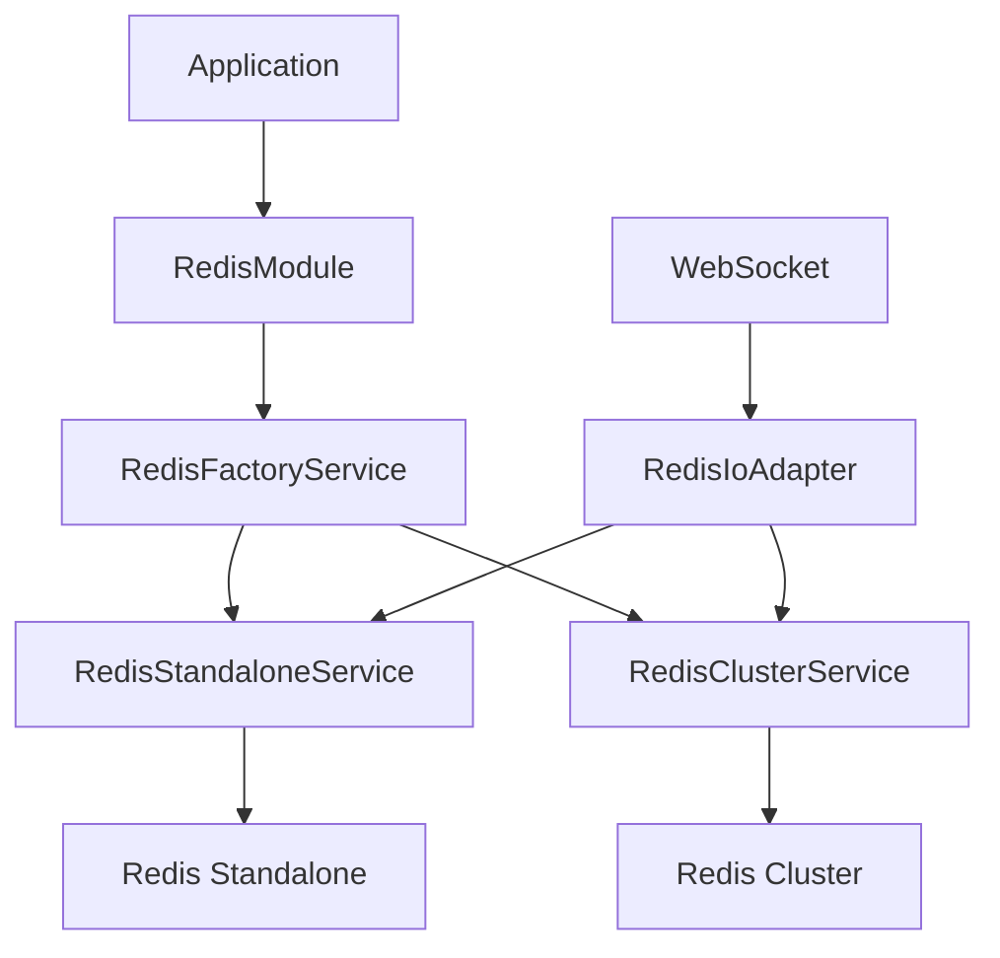

# Architecture Redis : Mode Cluster et Standalone

## Vue d'ensemble

L'architecture Redis de SL3 Beta est conçue pour supporter à la fois le mode cluster et le mode standalone, offrant ainsi une flexibilité maximale selon les besoins de l'environnement.

## Architecture Technique

### 1. Interface Commune (IRedisService)

L'interface commune définit un contrat standard pour les opérations Redis, garantissant une cohérence quelle que soit l'implémentation choisie.

```typescript
interface IRedisService {
  get(key: string): Promise<string | null>;
  set(key: string, value: string, ttl?: number): Promise<void>;
  del(key: string): Promise<void>;
  // ... autres méthodes communes
}
```

### 2. Services d'Implémentation

#### RedisClusterService
- Gère la connexion en mode cluster
- Supporte la répartition de charge
- Gère automatiquement les redirections
- Configuration multi-nœuds avec NAT mapping

#### RedisStandaloneService
- Connection simple à un seul nœud
- Pas de gestion de sharding
- Idéal pour le développement et les tests
- Performance optimisée pour les cas d'utilisation simples

### 3. Factory Pattern

Le `RedisFactoryService` instancie le service approprié selon la configuration :

```typescript
@Injectable()
export class RedisFactoryService {
  create(mode: 'standalone' | 'cluster'): IRedisService {
    switch (mode) {
      case 'standalone':
        return new RedisStandaloneService();
      case 'cluster':
        return new RedisClusterService();
    }
  }
}
```

## Configuration

### Variables d'Environnement
```env
# Mode Redis (standalone/cluster)
REDIS_MODE=standalone

# Configuration commune
REDIS_PASSWORD=sl3_redis_password
REDIS_HOST=localhost
REDIS_PORT=6379

# Configuration cluster (si nécessaire)
REDIS_CLUSTER_NODES=localhost:6379,localhost:6380,localhost:6381
```

### Docker
- Les conteneurs restent configurés en mode cluster
- Le mode standalone se connecte uniquement au nœud master
- Pas de modification nécessaire de la configuration Docker

## Avantages de l'Architecture

1. **Flexibilité**
   - Basculement facile entre les modes
   - Pas de modification du code applicatif lors du changement

2. **Maintenance**
   - Code isolé par responsabilité
   - Tests simplifiés
   - Facilité d'ajout de nouvelles fonctionnalités

3. **Performance**
   - Mode standalone optimisé pour le développement
   - Mode cluster disponible pour la mise à l'échelle

4. **Développement**
   - Interface commune pour les tests
   - Mocks facilités par l'interface
   - Documentation claire des contrats

## Considérations de Sécurité

1. **Authentication**
   - Mot de passe requis dans les deux modes
   - Support TLS si nécessaire

2. **Isolation**
   - Séparation claire des configurations
   - Pas d'exposition inutile des nœuds

## Monitoring et Logging

- Logs détaillés pour chaque mode
- Métriques spécifiques selon le mode
- Traçabilité des opérations

## Limitations Connues

1. **Mode Standalone**
   - Pas de sharding automatique
   - Pas de haute disponibilité native

2. **Mode Cluster**
   - Complexité accrue
   - Overhead de communication

## Bonnes Pratiques

1. **Choix du Mode**
   - Standalone pour développement/tests
   - Cluster pour production à grande échelle

2. **Configuration**
   - Utiliser les variables d'environnement
   - Documenter les changements de mode
   - Tester les deux configurations

## Structure des composants

### Core Components

#### RedisModule
- Module principal qui gère l'initialisation et la configuration de Redis
- Supporte deux modes d'initialisation :
  - `forRoot()` : Configuration globale
  - `forFeature()` : Configuration par feature

#### Services
- `RedisFactoryService` : Factory pour créer le service Redis approprié
- `RedisStandaloneService` : Implémentation pour Redis standalone
- `RedisClusterService` : Implémentation pour Redis cluster

#### Interfaces
- `IRedisService` : Interface commune définissant les opérations Redis
  - Opérations CRUD basiques
  - Gestion de la connexion
  - Monitoring et santé

#### Adaptateurs
- `RedisIoAdapter` : Adaptateur WebSocket avec support Redis
  - Gestion des sessions WebSocket
  - Support du mode cluster
  - Configuration CORS

## Flow de données



## Cycle de vie

1. Initialisation
   - Chargement de la configuration
   - Création du service approprié via Factory
   - Établissement de la connexion

2. Opération
   - Gestion des requêtes
   - Cache distribué
   - Sessions WebSocket

3. Arrêt
   - Nettoyage des ressources
   - Fermeture propre des connexions

## Points d'intégration

### WebSocket
- Utilisation de Socket.IO avec Redis Adapter
- Support de la scalabilité horizontale
- Gestion des rooms et événements

### Cache
- Cache distribué pour les API
- Cache de session
- Cache de données fréquentes

### Queue
- Intégration avec Bull
- Files d'attente pour :
  - Modération
  - Notifications
  - Récupération

## Sécurité

- Authentification Redis
- Encryption des données sensibles
- Isolation par environnement
- Protection contre les attaques DoS

## Monitoring

- Métriques de performance
- Logging des opérations critiques
- Alertes sur les erreurs
- Dashboard de monitoring

## Configuration

```typescript
// Example de configuration
{
  mode: 'standalone' | 'cluster',
  host: string,
  port: number,
  password: string,
  db: number,
  retryStrategy: Function
}
```

## Best Practices

1. Connection Management
   - Réutilisation des connexions
   - Retry strategy
   - Circuit breaker

2. Error Handling
   - Logging structuré
   - Retry avec backoff
   - Fallback gracieux

3. Performance
   - Pipelines pour les opérations groupées
   - Monitoring des métriques clés
   - Optimisation des patterns d'accès
